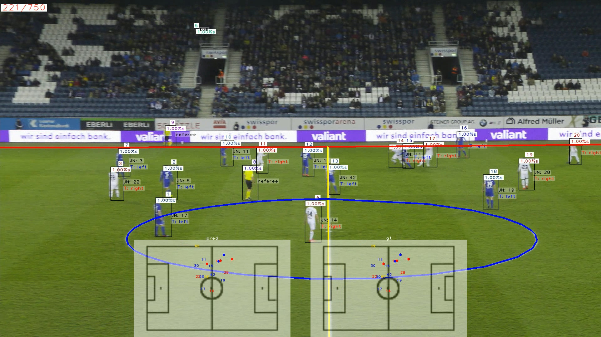

# SoccerNet Game State Challenge

Welcome to the SoccerNet Development Kit for the Game State task and Challenge.
This kit is meant as a help to get started working with the data and the proposed task.
More information about the dataset can be found on our [official website](https://www.soccer-net.org/).



## Installing TrackLab and the Gamestate baseline
First git clone this repository, and the [TrackLab framework](https://github.com/TrackingLaboratory/tracklab) *in adjacent directories* : 
```bash
mkdir soccernet
cd soccernet
git clone https://github.com/SoccerNet/sn-gamestate.git
git clone https://github.com/TrackingLaboratory/tracklab.git
```

### Install using conda
1. Install conda : https://docs.conda.io/projects/miniconda/en/latest/
2. Create a new conda environment : 
```bash 
conda create -n tracklab pip python=3.10 pytorch==1.13.0 torchvision==0.14.0 pytorch-cuda=11.7 -c pytorch -c nvidia -y
conda activate tracklab
```
3. Install all the dependencies with : 
```bash
cd sn-gamestate
pip install -e .
pip install -e ../tracklab # You don't need this if you don't plan to change files in tracklab
mim install mmcv==2.0.1
```

### Install using Poetry
1. Install poetry : https://python-poetry.org/docs/#installing-with-the-official-installer
2. Install the dependencies : 
```bash
cd sn-gamestate
poetry install
mim install mmcv==2.0.1
```

### Setup

You will need to set up some variables before running the code : 

1. In [soccernet.yaml](sn_gamestate/configs/soccernet.yaml) :
   - `data_dir`: the directory where you will store the different datasets (must be an absolute path !)
   - All the parameters under the "Machine configuration" header
2. For the corresponding modules :
   - The `batch_size`
   - You might want to change the model hyperparameters

## How to download SoccerNet-gamestate

We provide a SoccerNet pip package to easily download the data and the annotations.

To install the pip package simply run:

```
pip install SoccerNet
```

Then, to download the tracking data, enter the following commands:

```
from SoccerNet.Downloader import SoccerNetDownloader
mySoccerNetDownloader = SoccerNetDownloader(LocalDirectory="data/SoccerNet-GS")
mySoccerNetDownloader.downloadDataTask(task="gamestate", split=["train","test","challenge"])
mySoccerNetDownloader.downloadDataTask(task="gamestate-2024", split=["train", "test", "challenge"])
```

After running this code, please unzip the folders, so that the data looks like : 
```
data/
   SoccerNetGS/
      train/
      validation/
      challenge/
```


## Usage

run TrackLab on the command line with `tracklab` or `python -m tracklab.main`. All the additional
SoccerNet modules will be added automatically when installing this repository.

You can find all possible configuration groups possible at the top when running the following command :  
```bash
python -m tracklab.main --help
```

By default, tracklab will use generic defaults, in order to use the appropriate defaults for the
SoccerNet baseline, run it with :
```bash
python -m tracklab.main -cn soccernet
```

You can change the values of this config in [soccernet.yaml](sn_gamestate/configs/soccernet.yaml).

## Adding a new module

If you want to add a new module in the tracklab pipeline, you can either add it in this repository,
by adding code in (a new directory in) [sn_gamestate](sn_gamestate) and configuration files in 
[sn_gamestate/configs/modules](sn_gamestate/configs/modules), which will be added automatically. 

If you would like to create a separate project that makes use of tracklab, you will need to declare
the location of your config file using an [entry point](https://setuptools.pypa.io/en/stable/userguide/entry_point.html#entry-points-for-plugins).
The entry point group should be `tracklab_plugin` and it should point to a class containing a variable called `config_package`,
as shown [here](sn_gamestate/config_finder.py), this variable should point to the location of your configuration folder.
Temporarily, you can also specify a directory using Hydra's `--config-dir`.
